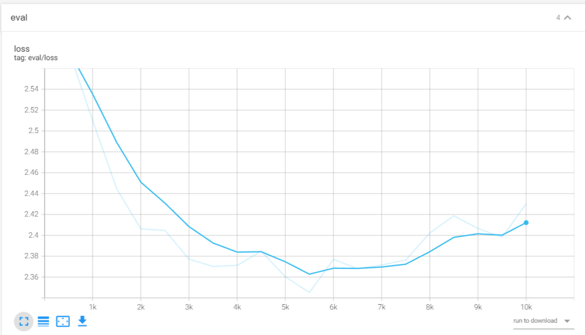
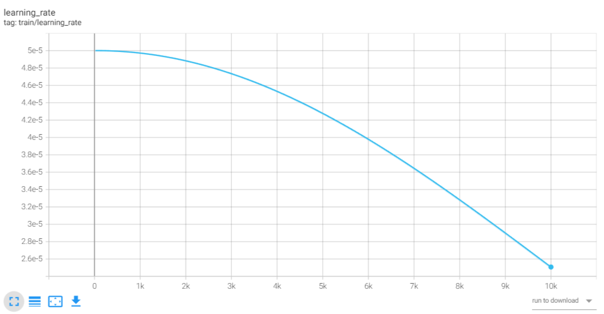
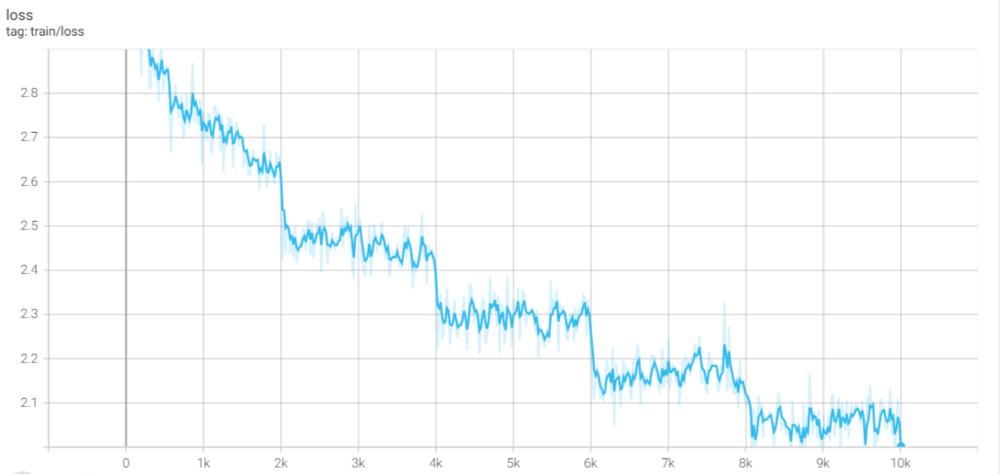

# Scripture GPT Repository

The Scripture GPT repository is designed to finetune models on sacred texts such as the Gita, Bible, and Quran. This project aims to enhance the understanding of the spiritual context within these scriptures using machine learning models.

The project is created with the mindset of submitting in Nvidia's RTC TensoRT-LLM competition.

https://www.nvidia.com/en-us/ai-data-science/generative-ai/rtx-developer-contest/

The contest ask is to develop it for windows only.

Sample Video:  https://drive.google.com/file/d/1djR_H3Cv-vOf2mWC8rfGqTQuRjA7IVIC/view?usp=drive_link

# Usage

## Clone the repository

```
git clone https://github.com/dhruvildarji/scripture_gpt.git
git checkout master
cd scripture_gpt
git submodule update
```

## Installing TensorRT-LLM

This is the first and most important step.
We didnt do reinvent anything here. Nvidia's TensorRT-LLM library has very neat and clean documentation to install this lib.

Please use following link to build this library in your windows system.

https://github.com/NVIDIA/TensorRT-LLM/tree/v0.7.1

Once its installed follow next steps.

## Build the Model

In order to build the model, you need to use finetune.py

In data folder there are 4 varients of train and test data available.

1.) Gita

    -	gita_train_split.txt

    -	gita_test_split.txt

2.) Bible

    -	bible_train_split.txt

    -	bible_test_split.txt

3.) Quran

    -	quran_train_split.txt

    -	quran_test_split.txt

4.) Gita + Bible + Quran

    -	GBQ_train_split.txt

    -	GBQ_test_split.txt

Please use any of this and put it in finetune.py script.

Here is how you should run finetune.py ideally

```
cd scripture_gpt
python scripts/finetune.py --epochs=20 --output_dir=./models/output_bible --train_file_path=./data/Bible/bible_train_split.txt --eval_file_path=./data/Bible/Bible_test_split.txt
```

It should give you generated finetuned model in models/ directory

Here `output_bible` is the directory I have given to store the model weights.

Make sure it is stored in `.\models` directory.

Now, the time is to convert it into TensorRT-LLM supported format.

In order to make it easy, we have created `build.bat `file

This is how you should run build.bat file

`cd scripts `

`.\build.bat output_bible`

* First argument: --output_directory you have given. Just put the name of the directory.

This script should generate models/output_bible/engine_output folder.

engine_output folder should contain config.json file and *.engine files

Here, this engine file is very important to accelerate with TensorRT_LLM library.

## Run the model

There are two ways to run the model.

### Build and Run

The way to build the model is defined above.

you will have engine_output folder in model directory.

Run run.bat like following.

`.\run.bat output_bible "What does Jesus says about humanity?"`

* first argument : the folder you have chosen to build your model
* Second argument : input text/The question you can ask which you need an answer.

### Download and Run

In order to run the model, you need to download the models.

Paste your models right in ./models directory.

Models : [https://drive.google.com/drive/folders/14ClYRVo4XsoCYOeEGMvTW8lwiUEXrK0i?usp=drive_link]([https://drive.google.com/drive/folders/14ClYRVo4XsoCYOeEGMvTW8lwiUEXrK0i?usp=drive_link]() "click to go to the link")

Please download the models from above link. Paste the required models in models directory

Example:

I would like to run Bible_finetuned model

Download models from above link

```
cp -r /path/of/scripture_models/Bible_finetuned ./models/
```

Now run like following

`.\run.bat output_bible "What does Jeses says about Humanity"`

## Supported OS

Windows system only

## Model Selection

For this project, we've chosen to work with the GPT-2 model, which has 124M parameters. This smaller model size allows for quicker loading and finetuning times, making it an efficient choice for our purposes.

### Why GPT-2?

- **Efficiency:** The GPT-2 model, due to its smaller size, can be finetuned rapidly with various parameters.
- **TensorRT-LLM Library:** Our goal is to utilize the TensorRT-LLM library to accelerate these finetuned models, optimizing for performance.
- **Limited Resources:** We had only RTX 4070 GPU with 8 GB of VRAM only. Not lot of models can be loaded with 8 Gig of VRAM

## Experimentation

We have experimented with several models from the tensorrt-llm library, including GPT-2, QWEN, and BERT. The primary focus is on optimization to ensure the algorithms run in the most efficient manner possible. Given these

We have also tried to train Geeta, Quran and Bible in singular file. The file is showed in data folder named GBQ_train_data.txt and GBQ_test_data.txt, but the results are not very impressive with it.

Here are some results of train and val losses (You can visualize this in TensorBoard in VS code)







## Data Handling

We basically collected this data from open source translated English books of this scriptures. After copy and pasting of this books, we cleaned those books with some technics. Those techniques are mentioned in cleanup.py in script section.

This can be scopped high with bigger model and more cleaned and more training data.
